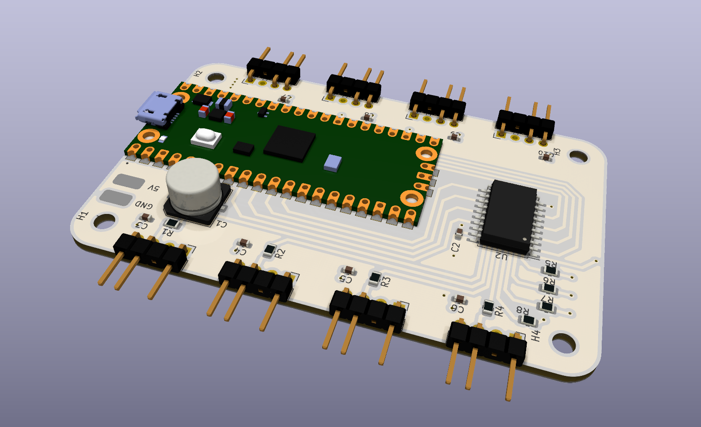

# RPi Pico Signal RGB Controller

This is a simple addressable RGB LED controller (WS2812 LEDs) based on the [Raspberry Pi Pico](https://www.raspberrypi.com/products/raspberry-pi-pico/), and compatible with the PC component RGB lighting software known as [Signal RGB](https://www.signalrgb.com/).  This controller features 8 independent addressable RGB LED outputs, each with filtering capacitors and a resistor on the data line per the recommended specifications. Each LED channel is also driven by the Pico through a level-shifter, providing full 5V to the data line. To supply 5V to the controller, there are two pads where the user can choose to solder a Molex, SATA power, or other 5V power source.

The number of LEDs on each channel is configurable via the online configurator available at [SRGBmods](https://srgbmods.net/). The controller made possible by, and relies on the code provided by [SRGBmods](https://srgbmods.net/). I am not the author of the code which is meant to run on this controller.

